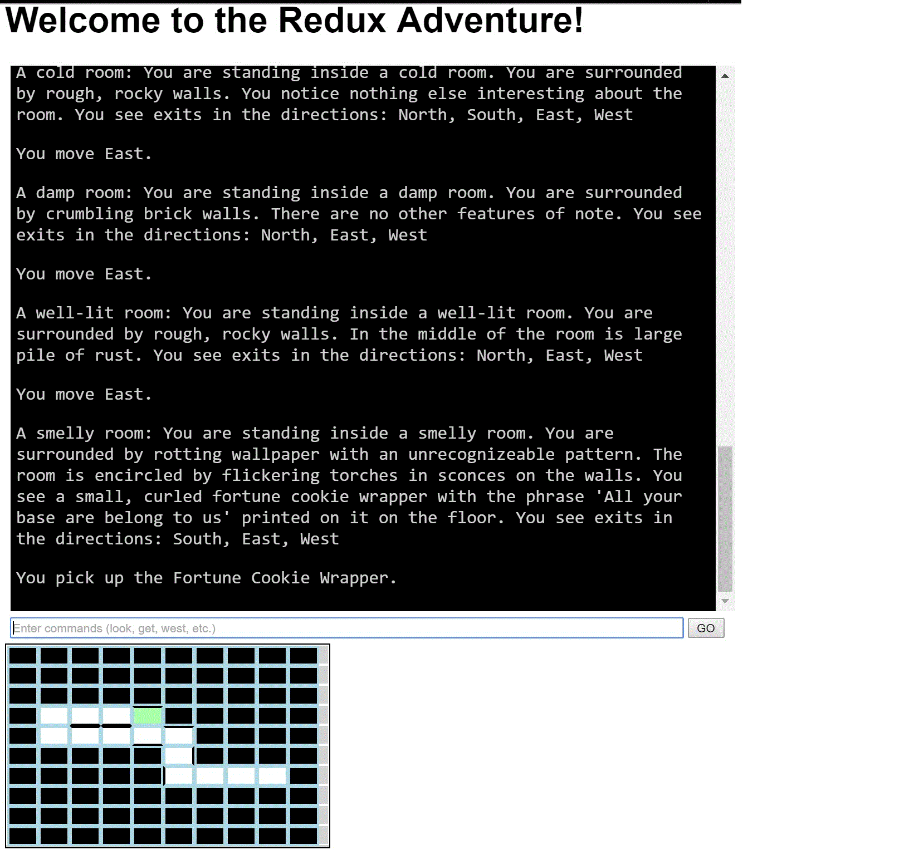

# redux-adventure

Redux Adventure is a text-based adventure game written in Angular 2 and TypeScript that leverages Redux. It is a simple implementation designed to both learn and teach the principles of an app that relies on Redux for state management.

## Quick Start 

First, clone the repo: 

`git clone https://github.com/JeremyLikness/redux-adventure.git`

`cd redux-adventure` 

Next, install the dependencies: 
`npm install` 

The project uses the [Angular-CLI](http://developer.telerik.com/featured/rapid-cross-platform-development-angular-2-cli/):

`npm i -g angular-cli` 

Now you can launch it:

`ng serve` 

## Objective 

The objective is to explore the dungeon and pick up all of the artifacts. You win the game when your inventory includes all possible items. The game will render a map of areas you've visited. The following commands are possible: 

`n north s south e east w west g get i inventory`

